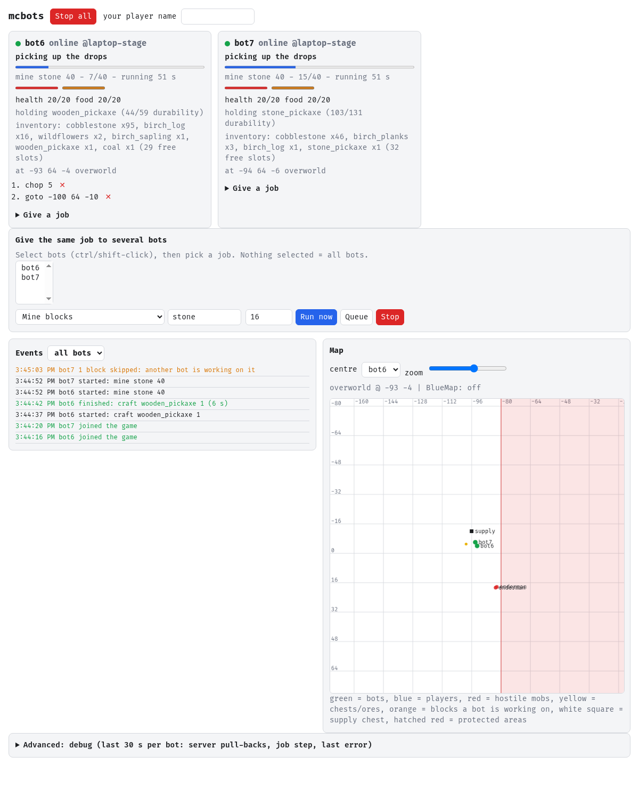
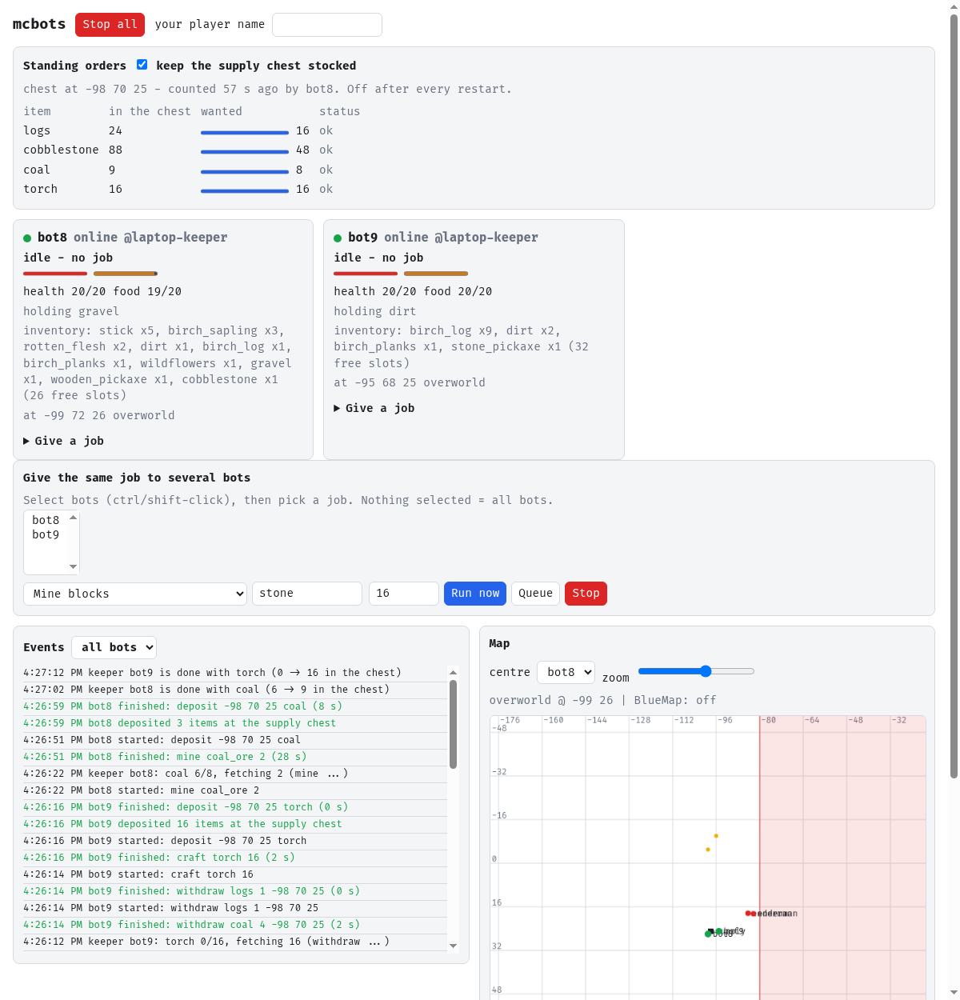

# Minecraft bots (Mineflayer)

Phase 1+2 of the bot system: Mineflayer bots join Paper through Velocity and
BotGate and are controlled from a small web dashboard. Code:
`hosts/bandit-lab/services/mcbots/` (`app/` is the Node app, `default.nix` the
lab deployment). Crafting and schematic building are later phases; a new job
type is one entry in `JOBS` and one in `VALIDATE` in `app/bots.js`.

## How it fits together

- Bots are named `bot1`..`bot4` on the lab (`bot5`+ on the laptop). BotGate
  admits offline logins only for `^bot[0-9]{1,2}$` from the owner laptop
  (`100.102.247.30/32`) or the `mcbots` Docker network (`10.250.77.0/29`).
- Lab: container `mcbots` (nix-built image, non-root uid 1000, 2 GiB / 2 CPUs,
  no capabilities, no mounts) on network `mcbots`, connecting to `velocity:25565`.
  The dashboard listens on `127.0.0.1:8095` (host) and is published to the
  tailnet by the oneshot `mcbots-https` (`tailscale serve`, never Funnel).
- Protocol: Mineflayer 4.39.0 supports up to 26.1; bots join with
  `version: '26.1'` and ViaBackwards translates to the Paper 26.2 server.
- The container is also attached to the `minecraft` network, only to read
  BlueMap at `http://minecraft:8100` (see Shared map). `velocity` is pinned
  with `--add-host=velocity:10.250.77.2` (its `mcbots` address) so the bots
  never reach it from a `minecraft`-network source, which BotGate refuses.
- Logins are staggered (4.5 s apart); reconnects back off 5 s, 10 s, ... up to
  5 min (at least 30 s after "logging in too fast").

## Deploy / disable

Deploy like any lab change (see `bandit-lab-updates.md`). Port 8445 must be
served once: Serve and HTTPS Certificates are already enabled for the panel;
after the first activation run `sudo systemctl restart mcbots-https`.

Disable: set `bandit-lab.mcbots.enable = false;` (or remove the
`./services/mcbots` import in `hosts/bandit-lab/default.nix`) and deploy.
Immediate stop without a deploy: `sudo systemctl stop docker-mcbots mcbots-https`.

## Dashboard

Open `https://bandit-lab.tail7facc9.ts.net:8445` from a tailnet device.
`tailscale serve` adds the header `Tailscale-User-Login`; the app answers 403 to
anything (HTTP or WebSocket) whose login is not in `ALLOWED_TS_LOGINS`
(`6FaNcY9@github`). POSTs and WebSocket upgrades also need a same-origin
`Origin`. Without `ALLOWED_TS_LOGINS` (laptop) the dashboard binds to
`127.0.0.1` only and refuses any other `DASHBOARD_HOST`.



The map is at the top: terrain from BlueMap's low-res tiles (`GET /api/tile/<map>/<lod>/x<i>/z<j>.png`,
fetched server-side from `BLUEMAP_URL`, cached 5 min). Drag to move, wheel to zoom. Click a bot
(select it: map actions then go to that bot only; show card; centre; stop), a player (selected bot
or all bots: come, follow) or a spot (go here, at the surface height read from the tile).

**Markers** (stage 1 of `CONTROL-CENTRE-GOAL.md`): right-click or click a spot, "Add a marker here…",
name, kind (`supply`, `chest`, `site`, `home`, `afk`) and y (for a chest: the chest block's own height,
F3). Click a marker for its actions: chests (empty inventory here, re-arm, count), sites (work shift
for logs/stone/ores into the nearest chest marker, guard), AFK (park the bot, fighting off), go here;
move, rename, delete. The first overworld `supply` marker replaces `SUPPLY_CHEST` for all bots, the
hub and the keeper; the first `site` marker replaces `KEEPER_SITE`. Kept in `STATE_DIR/places.json`.
Laptop workers get the supply chest only when they connect.

Each bot card has an **In-game view** (also from the map menu): a 256x144 first-person picture
rendered on the server from the blocks the bot has loaded (`app/view.js`, `GET /api/view/<bot>.png`,
one frame per bot per 0.7 s, refreshed every second while open). Blocks are flat colours by name,
players blue and hostile mobs red boxes; no textures. Laptop workers (bot5) have no view yet.

**Settings** per bot (card, or map menu): fight hostile mobs on/off, fight range (2-16 blocks: the
bot walks up to a hostile this close, so skeletons no longer shoot it from afar), retreat below
health, eat below food. `POST /api/settings {"bot": "bot1", "settings": {...}}` (same-origin JSON);
kept in `STATE_DIR/settings.json`, on the lab the named volume `mcbots-state` (the only mount the
`lab-mcbots` check allows). Laptop workers keep their defaults.

**Guard** job: `guard {x, y, z, radius}` or `guard {player, radius}` (radius 4-48, default 16). Until
stopped, the bot fights every hostile within the radius of the spot or player and walks back when
all is quiet. Map menu: "guard this spot" / "guard <player>"; composer: "Guard a spot", "Guard a player".

**Combat precision**: every swing lands exactly when the weapon is fully charged (sword 0.65 s,
axe 1.03 s) and is a critical hit (jump, strike on the way down: x1.5 and the crit sparkles); with
a sword and two or more hostiles together it is a ground swing instead, so the sweep hits all of
them. Live: two zombies killed in about 10 s, no server pull-backs. No sprint or strafing: movement
is where Paper pulls bots back.

**Torches** (setting "place torches where it is dark", on by default): during `mine`, `chop` and
`shift`, where the block light at the bot's feet is below 7 and no torch is within 5 blocks, it puts a
torch on a wall at head height (floor if there is no wall). Out of torches with coal or charcoal in
the inventory: it crafts 4 (one try per 5 min).

**Ore heights**: an ore job first digs down (or up) into the ore's band (iron 0..40, copper 30..70,
coal 40..130, gold -30..-5, lapis -15..15, redstone/diamond -60..-45, emerald 100..250; 26.2 keeps
the 1.18 distribution), ores outside the band count 4 extra per level, and when nothing is left in
reach it tunnels 32 blocks sideways (up to 6 times) instead of failing. Live: `mine iron_ore 8`
from the surface, 11 raw iron in 153 s, ending at Y 32.

**Staying put and kitted**: a shift never works more than 64 blocks (horizontally) from its chest;
an unreachable block makes the bot skip the whole vein around it (4 blocks) for 5 min; armour in the
inventory goes on at once; a log job without an axe makes a stone or wooden one first.

**Sealing**: water or lava next to a target block is plugged first: the bot places a rubble block
(cobblestone, cobbled deepslate, dirt, granite, ...) against the target's face towards the fluid,
then mines the target; without rubble it skips the block. Live: water above a test ore sealed with
granite, ore mined in 16 s.

**Jobs survive restarts**: every 2 s the running and queued `shift`, `guard`, `mine` and `chop` jobs
are saved to `STATE_DIR/jobs.json` (a mine/chop with what is left of its count) and queued again
once each bot is back online after a restart or deploy (a bot away for more than 5 min starts
empty). A shift whose bot is far from the chest (respawned at world spawn) walks back first.

**Junk**: during ore and log jobs, with fewer than 4 free slots, the bot throws away cobblestone
(keeping one stack), cobbled deepslate, dirt, gravel, granite, diorite, andesite, tuff and the like
(not what the job is mining). Torches never hang on a block of the job's target type.

**Targets**: `mine`/`shift` of an ore also take its deepslate variant; ores are searched within 128
blocks (no anti-xray on the server, so bots see ores through stone), nearest first so a vein is
finished; stone and logs prefer blocks at or above the bot (2 extra cost per level down).

One card per bot: an activity line in plain words ("mining stone 6/40 near -94
66 -2", "walking to the supply chest to deposit", "idle - no job", "dead -
respawning", "offline - last seen 3 min ago"), a progress bar for jobs that
count (a work shift has no end, so no bar), health and food, the held tool with
its durability (red below 15 %), inventory summary with free slots, host
(`@bandit-lab`, `@laptop (remote worker)`), position, and the queue with an x
to remove a queued job. A "problem" line shows the last error with its age
(grey after 5 min); a death clears itself on respawn.

Each card has "Give a job" (job types with fields; coordinates start at the
supply chest; "Run now" replaces the running job and the queue, "Queue" adds
behind it, "Stop" clears both). "Stop all" in the header and "Give the same job
to several bots" (select bots, none = all) work on many bots. "Come to me" uses
the player name typed into "your player name". The map shows bots, players,
mobs, chests/ores, claimed blocks (orange), the supply chest and the protected
areas (zoom with the wheel). "Advanced: debug" is the panel described below.

### Events and `GET /api/events`

The Events panel lists the last 200 events (job started / finished / failed /
stopped, death, respawn, deposit, a bot skipping blocks another bot holds,
joined/left the game, a worker connecting or going offline). They live in a ring
buffer in the hub process (`app/events.js`, lost on restart); `GET
/api/events?since=<id>` returns `{lastId, events: [{id, t, bot, kind, text}]}`
with ids above `since`. Workers send theirs with their status frames; the hub
keeps only events for the worker's own bots, with a known kind and at most 200
characters.

The page's Content-Security-Policy allows exactly its own inline script and
style by hash (`default-src 'none'`, `connect-src 'self'`): no CDN, no other
origin. A change to the page changes the hashes automatically.

### Debug panel and `GET /api/debug`

The "Debug" section on the dashboard (collapsed by default; polls every 2 s while
open) shows per bot: how often the server pulled the bot back in the last 30 s
(red from 10), the current job step with its running time, pathfinder and
physics state (on ground, wall contact, velocity, pressed keys), the last error
with its age, and the last 30 s of positions as a small track. "Copy
/api/debug JSON" copies the same data for a bug report.

`GET /api/debug` returns `{generatedAt, windowS, bots: [{name, online, pos,
dimension, job{type,args,status,progress,runningS}, queue, combat, physics,
pathfinder, positions[{agoS,x,y,z}], corrections{total,last30s,lastAgoS},
lastError{message,agoS}}]}`. It sits behind the same login check as the rest of
the dashboard. Positions are sampled every 500 ms (rounded to 0.01) and kept for
30 s. The bot cards also show "pulled back N x in 30 s" when it is not zero.

## Hub: bots on other machines (laptop bot5)

The lab app is also the hub. A worker on another machine runs its own bots
(Mineflayer on that machine, joining Velocity from its tailnet address) and
reports to the hub; the dashboard then lists them next to bot1..bot4 with host,
online state and last-seen, sends their jobs, and the hub decides every block
reservation so lab and laptop bots never dig the same block.

```bash
nix run .#mcbots-worker -- bot5          # on the laptop; Ctrl-C stops the bot
```

- Names must match BotGate (`bot5`..`bot99`) and not be one of the lab's
  `BOT_NAMES`. The laptop is admitted by its tailnet address as before.
- Wiring: the container publishes the worker port on `127.0.0.1:8096`;
  `mcbots-https` exposes it with `tailscale serve --https=8446` (tailnet only,
  never Funnel). The port serves nothing but the WebSocket upgrade on `/worker`
  and needs `Authorization: Bearer <token>`; everything else is 404. The
  dashboard (8445) stays limited to `ALLOWED_TS_LOGINS` and has no worker route.
- Token: sops secret `mcbots-worker-token` in `secrets/lab.yaml` and
  `secrets/bandit.yaml` (same value). The lab hands it to the container through
  `/run/mcbots/seed.env` (never the plain environment); the laptop reads
  `/run/secrets/mcbots-worker-token` (`nixos/secrets-workstation.nix`, owner
  `vino`, 0400; needs one `nrs` after the first pull). Rotate by setting both
  keys again, deploying the lab, `sudo systemctl restart mcbots-seed docker-mcbots`
  and `nrs` on the laptop.
- What a worker may do: act only for the names in its hello, claim at most 8
  blocks per bot, report mobs/blocks/status. Everything it sends is
  re-validated and size-capped on the hub (`hub.js`). Jobs go the other way
  and are validated on the hub first, then again on the worker.
- Reservations: the hub's `WorldModel` is the only table. A worker asks per
  block (about one tailnet round trip) before it digs; if the hub is
  unreachable it refuses ("hub unreachable: not digging without block
  reservations") instead of guessing. Claims of a worker that disconnects are
  freed at once; otherwise they expire after 2 min.
- Offline: a worker that disconnects (or goes silent for 30 s) stays in the
  list as offline with its last-seen time. `Stop` for "all" skips absent
  workers; naming an absent bot is an error. A worker keeps its bots playing
  while the hub is away and reconnects with back-off (1 s .. 30 s).
- Protected areas and the supply chest come from the hub (`welcome`), so the
  laptop needs no copy of them.
- Troubleshooting: `HTTP 401` = wrong or missing token; `HTTP 404` on
  `/worker` = old image or Serve not published (`tailscale serve status`, then
  `sudo systemctl restart mcbots-https`); hub log lines start with `[hub]`
  (`sudo docker logs --tail 50 mcbots | grep '\[hub\]'`).

## Laptop (stand-alone, without the hub)

```bash
BOT_NAMES=bot5,bot6 MC_HOST=100.125.161.81 nix run .#mcbots
# dashboard: http://127.0.0.1:8095
```

Other variables: `MC_PORT` (25565), `DASHBOARD_PORT` (8095). Use at most the
names not used by the lab. Ctrl-C quits the bots cleanly.

## Shared map and combat

All bots in a process share one world model (`app/world.js`), shown on the
dashboard radar and served by `GET /api/state` (`bots`, `world`,
`protectedAreas`; also `GET /api/world`) and over the WebSocket.

- Players: BlueMap `/maps/<map>/live/players.json` for `world`,
  `world_the_nether`, `world_the_end`, polled every 2 s (`BLUEMAP_URL`; empty
  disables). Players hidden from BlueMap are not seen. If BlueMap fails, the
  radar shows "unavailable" and bots fall back to entity tracking.
- Hostile mobs seen by any bot (30 s, at most 200), chests/barrels and
  diamond/emerald/ancient debris ore within 32 blocks of a bot (10 min, at most
  100). A bot waits up to 10 s before walking to or mining at a spot with a
  reported hostile within 8 blocks, then goes anyway.
- Access: BlueMap listens on the `minecraft` container; the bots container
  joins the `minecraft` network to read it. Paper there has `velocity.enabled`
  and rejects logins without Velocity's forwarding secret (config-derived, not
  tested at runtime); the container has no mounts or capabilities. It can also
  reach the VoxelDash panel port 7867 (password protected) there.
- `come`/`follow`: when the player is not tracked, the bot walks toward the
  BlueMap position (same dimension only; otherwise the job fails) and switches
  to the live player once visible. `come` allows 90 s plus 1 s per block of
  distance, at most 10 min.
- Combat (`app/combat.js`, every 500 ms): hostile mobs only, never players or
  animals. A hostile within 4 blocks is attacked with the best sword/axe in the
  inventory (swords before axes); creepers within 6 blocks are backed away from,
  not fought. Endermen, piglins, wardens, the wither/dragon, ghasts and breezes
  are never attacked. Below 8 health the bot retreats from hostiles within 16
  blocks until health is 12; its job pauses and resumes afterwards. Food below
  15 is eaten when nothing hostile is near (not raw chicken, rotten flesh,
  spider eyes, pufferfish, poisonous potatoes, golden apples).
  Defending inside `PROTECTED_AREAS` is allowed.

Dashboard radar: top-down, north up, centred on any bot or BlueMap player,
zoom by slider or wheel; shows bots, players, hostiles (fading), chests/ores
and the protected boxes (overworld only).

## Jobs

Each bot runs its queue one job at a time. Chat is never read as a command.

| Job | Arguments | Notes |
| --- | --- | --- |
| `goto` | x y z | walks within 1 block; gives up after 90 s; waits briefly if a hostile is reported at the target |
| `follow` | player | until `stop`; uses the BlueMap position when the player is not tracked; fails if the player is in another dimension or not on the map |
| `come` | player | walks to the player (BlueMap position when far); 90 s + 1 s/block, max 10 min |
| `mine` | block, count | `mine iron_ore 8`; nearest block within 64, best tool is equipped |
| `chop` | count | any `*_log` within 64 blocks |
| `deposit` | x y z, optional `only` | puts everything except tools, food and crafting stock (planks, sticks, coal, torches, table, furnace) into the chest/barrel there; with `only` (an item name, `logs` or `coal`) just that kind, including what is normally kept |
| `withdraw` | item, count, x y z | takes up to `count` of an item (or `logs`) out of the chest/barrel |
| `stock` | x y z | opens the chest and reports its contents (changes nothing); for the supply chest the numbers go to the keeper |
| `place` | item, x y z | puts one block (chest, crafting table, ...) on top of the solid block under x y z; crafts it first when missing; refused inside protected areas |
| `say` | text | up to 200 characters; text starting with `/` is rejected |
| `stop` | | clears the queue and stops walking/digging |

## Long runs

What a bot does on its own while a `mine`, `chop` or `shift` job runs (`upkeep()`
in `app/bots.js`, checked before every block):

- **Broken tool**: no pickaxe that can harvest the block: craft a stone pickaxe,
  else a wooden one (chopping 3 logs first when it has no wood), else take one
  from the supply chest; then carry on where it was. Chopping without an axe is
  fine, so a broken axe is not replaced.
- **Hunger**: food below 14, none in the inventory and a supply chest set: walk
  there and take food (the `rearm` routine), at most once per 10 min. The
  existing combat loop eats from the inventory below 15.
- **Full inventory** (fewer than 2 free slots) in a job that is not a `shift`:
  deposit into the supply chest and carry on. A `shift` deposits into its own
  chest. Without a chest the job fails with a clear message.
- **Death or disconnect**: the running job (`mine`, `chop`, `shift`, `goto`,
  `deposit`, `follow`, `come`) goes back to the front of the queue behind the
  re-arm, keeps its count (`collected`), and the bot first walks back to the
  last block it worked on. Nothing runs while the bot is dead. A job interrupted
  more than 3 times is given up ("gave up" event). A job you stopped is never
  resumed. `craft`/`smelt` are short and start over.
- **Unreachable block** (`could not reach`): skipped for 5 min; five in a row end
  the job. A dig the server never answers is abandoned after 25 s; a walk that
  never settles is ended by the 90 s deadline (`pathfinder.stop()` alone does not
  settle a pending `goto`, `setGoal(null)` does).
- **Claims** that expired no longer count toward the per-bot cap of 8 and are
  pruned; a remote bot offline for over an hour leaves the list; a wrong token
  earns the guesser a 429 after 20 tries a minute but never locks the real
  worker out.

## Standing orders (keeper)

A switch on the dashboard ("Standing orders") that keeps the supply chest stocked
(`app/keeper.js`). Quotas are declared in `default.nix` (`KEEPER_QUOTAS`, now
`logs:64,cobblestone:128,coal:32,torch:64`; optional `KEEPER_SITE=x,y,z` to walk to
before chopping or mining). Without `SUPPLY_CHEST` or quotas the panel is absent.

- **Off after every restart.** Switching on does nothing but read the chest and
  plan; switching off stops planning (bots finish their jobs; use Stop to end them).
- **Stock** comes from whichever bot last opened the chest (`deposit`,
  `withdraw`, `stock` jobs, also from laptop workers). Numbers older than 15 min
  or unknown: an idle bot is sent to count (`stock` job).
- **Planning** every 5 s: the first quota below target with nobody on it goes to an
  idle bot (idle for 10 s, no queue, not dead, online; lab bots and connected workers
  alike), at most two bots at once, at most 64 items per chain, as normal queued
  jobs: logs = `chop` + `deposit only logs`; cobblestone = `mine stone` + `deposit
  only cobblestone`; coal = `mine coal_ore` + `deposit only coal`; torch = `withdraw
  coal`, `withdraw logs`, `craft torch`, `deposit only torch` (only when the chest
  already holds the coal and a log). Everything shows up in the cards, the event log
  ("keeper") and can be stopped like any other job.
- A chain that ends without the chest getting more of the item puts that item on a
  10 min cooldown (no ore nearby must not become a loop). Items without a recipe
  in the keeper show "no way to make this".
- Bots dig where they stand (nearest blocks within 64); set `KEEPER_SITE` if the
  spawn surroundings should stay untouched. Protected areas stay protected.
- API: `GET /api/keeper`, `POST /api/keeper {"enabled": true|false}` (same-origin
  JSON only); the state is also part of every `/api/state` and WebSocket frame.



## Schematic building (design only, not built)

Status: designed in the autopilot run, deliberately not implemented. The owner's
test rule (a build of at most 5x5x3 within 40 blocks of spawn, outside the
protected areas, with no player-made block within 10 blocks, removed afterwards)
needs a look at the lab's spawn surroundings that a laptop run cannot make
safely, and a `build` job writes to the live world. The pieces it needs already
exist: `place` (one block), block claims, `upkeep`, the queue and the dashboard.

- **Blueprint**: JSON `{"origin": {"x","y","z"}, "blocks": [{"x","y","z","block"}]}`
  with x, y, z relative to the origin, `block` a plain block name (no states, no
  containers, no gravity blocks, no liquids, no doors). At most 75 blocks and a
  5x5x3 bounding box; the origin must not be inside a protected area, and every
  target position must be air (or replaceable: grass, flowers) with a solid or
  already planned block under or beside it.
- **Order**: bottom layer first (y ascending), then z, then x, so every block has
  a neighbour to be placed against. A block waits until that neighbour exists.
- **Scaffolding**: none. The height limit of 3 keeps every target within reach
  (4.5 blocks) from the ground beside the structure; bots stand outside the
  footprint (`GoalPlaceBlock`), never pillar, never dig to make room. A target
  that is not reachable from the ground is reported, not worked around.
- **Several bots**: each takes the next free block through the existing claim
  table (key `dim:x,y,z`, the same as for digging, so a dig and a placement can
  never meet on one block), places it, releases it, and takes the next one. A
  `build` job is "place blocks of this blueprint until none is left", so any
  idle bot can join by queueing the same job.
- **Material**: counted up front from the blueprint; the job fails before
  placing anything when the inventory lacks it (a later phase may withdraw from
  the supply chest like the keeper does).
- **Undo**: a `build` with `remove: true` digs the same blueprint top-down with
  the same claims and keeps the blocks; the live test would end with it.
- **Tests first**: pure functions for validation (bounds, protected areas,
  allowed blocks), ordering and the "has a neighbour" rule, with a fake world,
  before any bot places a block.

## Limits

- Bots defend themselves against hostile mobs only (see above); they do not
  avoid lava or players' builds beyond not tunnelling or placing blocks while
  walking, and they cannot cross dimensions.
  `mine`/`chop` do break blocks: do not point them at player builds.
- Pathing cannot dig or bridge, so a goal behind solid rock is reported as
  "could not reach".
- Velocity admits at most the `/29` network: gateway, Velocity and 4 bots.
- The dashboard trusts the `Tailscale-User-Login` header. Only `tailscale serve`
  (host) and containers on `mcbots` (Velocity) can reach it; keep it that way.

Reservation counters: `/api/debug` shows per bot `claims {granted, refused,
timedOut}` (timeouts = the hub did not answer within 3 s) and, for remote bots,
a `workers` summary per host; the Debug panel prints them as "reservations".

## Shipping to the lab

`tools/ship-claude [--dry-run] SHA...` prepares a ship from a branch: clean
detached worktree on `origin/main`, `cherry-pick -S` (your GPG key), signature
check, build of the committed `bandit-lab` revision, then it prints the exact
`git push origin HEAD:main` line and stops. It never pushes; the push deploys
within the hour. `--dry-run` skips signing and the build. Test:
`tools/ship-claude.test.sh` (throw-away repos, asserts nothing is pushed and the
dirty tree does not leak).

## Troubleshooting

- Bot offline, "logging in too fast" / throttled: wait; the runner backs off
  itself. Do not restart repeatedly.
- Kicked with a not-whitelisted/online-mode message: BotGate refused it. Check
  `sudo docker logs velocity 2>&1 | grep -i botgate` for the decision line (name
  pattern or source address). The name must match `^bot[0-9]{1,2}$` and come
  from the allowlisted source.
- Other Velocity problems: `sudo docker logs --tail 100 velocity`.
- Dashboard: `sudo journalctl -u docker-mcbots -u mcbots-https -n 50`,
  `sudo docker logs --tail 100 mcbots`. HTTPS unreachable: `tailscale serve status`,
  then `sudo systemctl restart mcbots-https`. 403: your Tailscale login is not in
  `ALLOWED_TS_LOGINS`, or the request bypassed `tailscale serve`.
- Bot stuck at a block (dashboard shows the same position, ~20 server
  corrections per second, "breaking the block frees it"): Paper 26.2 refuses a
  position whose box touches a block face exactly (gap 0.0), while a gap of
  1e-6 is accepted. Mineflayer's collision ends exactly flush, so the server
  pulled the bot back every tick. `app/physicsfix.js` makes every horizontal
  collision stop 1e-4 short (found 2026-10-08 with raw position packets against
  a one-block step; fixed and checked with 3 round trips to -104 71 -7, 0
  corrections). Widening the player box instead does not work: prismarine-physics
  lets a box that already overlaps a wall walk straight through it. If it
  returns, count `forcedMove` per bot first; `unwedge()` in `bots.js` only
  re-centres as a last resort.
- Image changed but the old one runs: the image tag is the Nix store hash;
  `sudo systemctl restart docker-mcbots` after activation.
